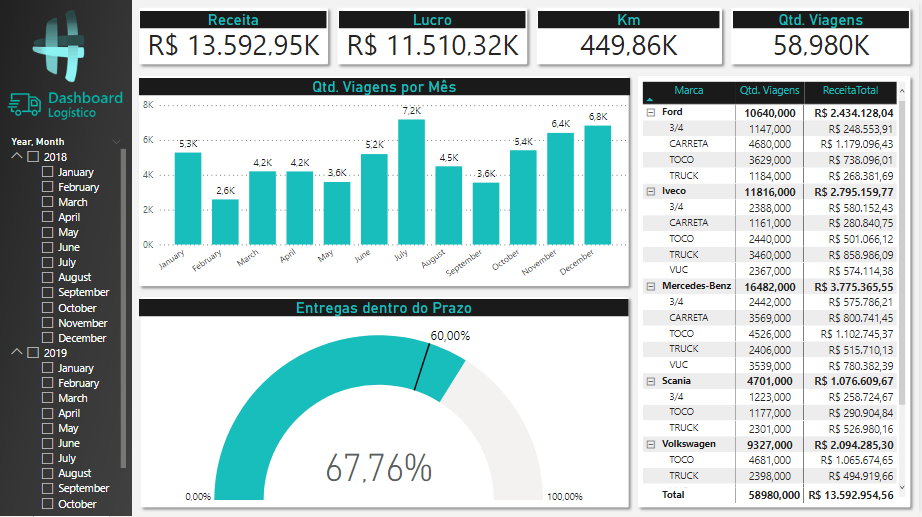

# Power BI
Repositório dedicado ao estudo de análise e visualização de dados
Algumas fontes de dados utilizadas são fictícias, pois são utilizadas apenas para aprender.

## Ferramentas utilizadas:
- [Power_BI](https://powerbi.microsoft.com/pt-br/desktop/)
- Excel

## Treinamento da Empowerdata:
Canal [Empowerdata](https://www.youtube.com/channel/UCX8dXdLxlgBSKcOhb-ixuJg)

### Dashboard para setor de recursos humanos:
- [Análise-Dashboard](/People-Management-Analysis/Human-Resources-Analysis.pbix)
- [Database](/People-Management-Analysis/Database)

### Dashboard para setor Financeiro:
- [Análise-Dashboard](/Sales-Analysis/Finance-Section-Analysis.pbix)
- [Database](/Sales-Analysis/Database)

## Hashtag Treinamentos:
Canal [Hashtag](https://www.youtube.com/channel/UCw0leRmeaX7R_9BDd3TvCzg) 

### Dashboard Vendas
- [Reports](./Purchases/Dashboard-Compras.pbix)
- [Database](./Purchases/Compras.xlsx)

### Dashboard Logistíca
- [Reports](./Logistics/dashboard-logistic.pbix)
- [Database](./Logistics/Base-Logistica.xlsx)

     

